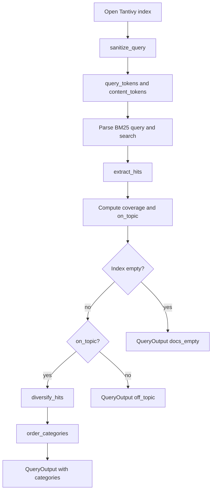
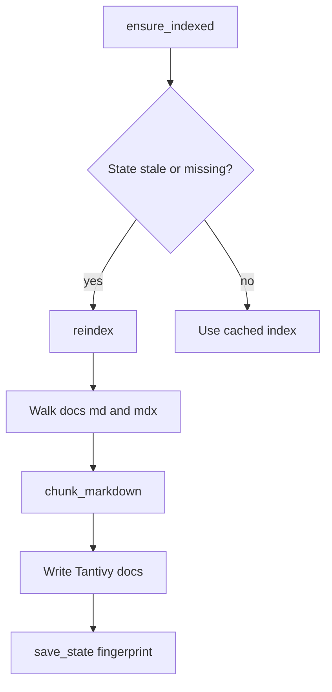

# Search engine (`src/engine.rs`)

BM25 index + query pipeline for `hermes-docs-search`. Behavior contract lives in
[CONTRACT.md](../CONTRACT.md); this page is only for **how the Rust code is
shaped**.

Source of truth for the diagram also appears in the module docs at the top of
[`src/engine.rs`](../src/engine.rs).

## Query pipeline

## Index pipeline

